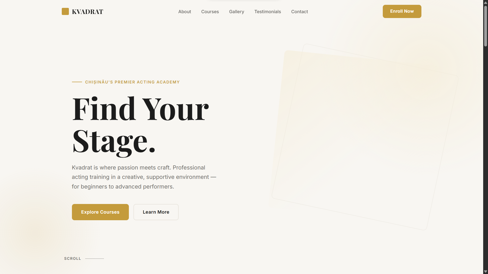
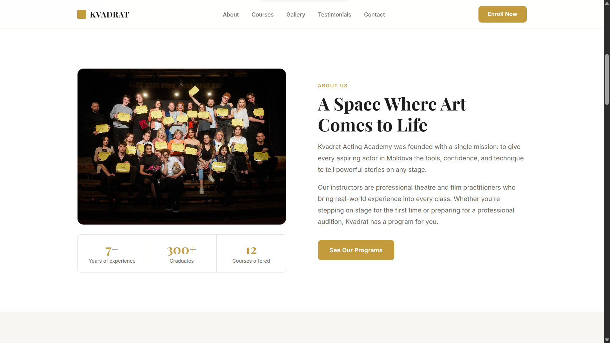
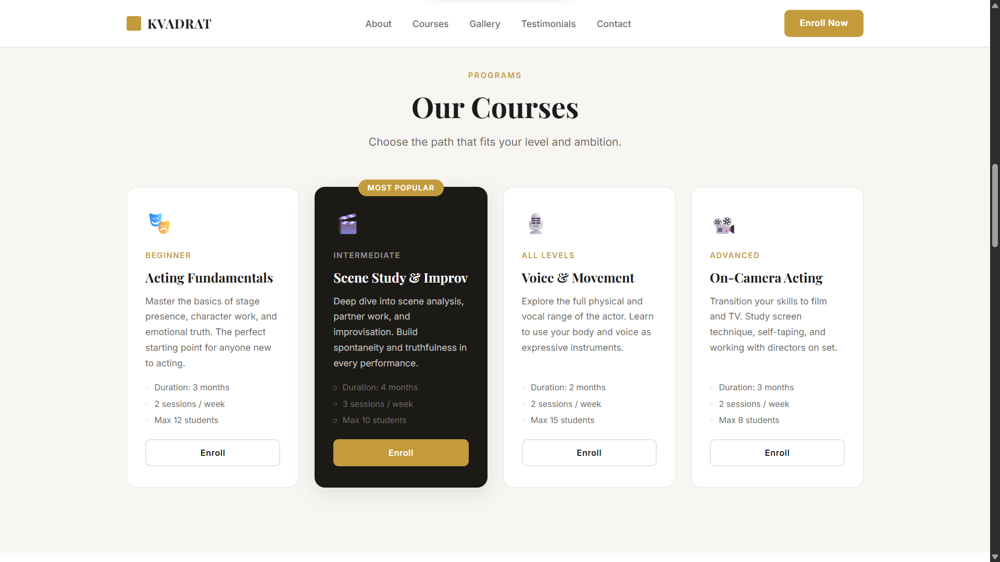
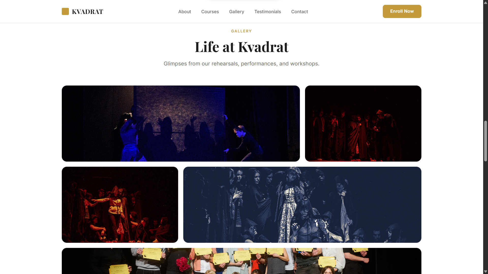
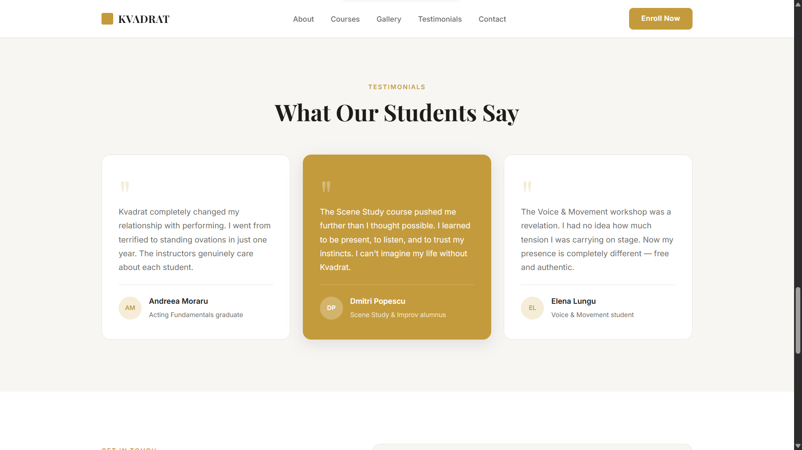
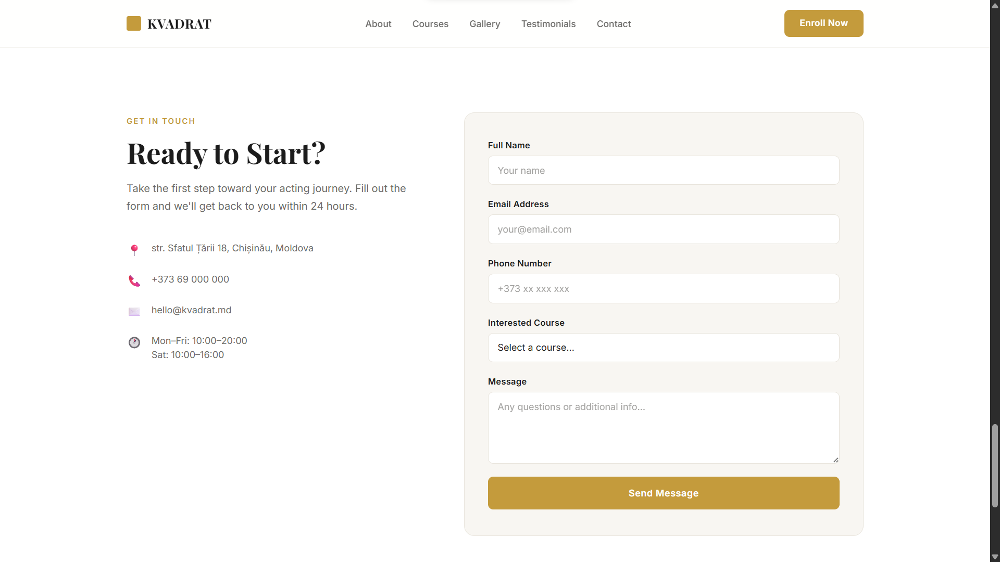

# Kvadrat — Acting Academy Landing Page

A clean, responsive landing page for **Kvadrat** — a professional acting academy based in Chișinău, Moldova.

> **Live demo:** _[Add your deployed URL here]_

---

## About the Project

Kvadrat (Квадрат) is an acting mastery academy in Chișinău. This landing page showcases the academy's courses, gallery, student testimonials, and a contact/enrollment form.

The design uses a **light & minimal** aesthetic with warm gold accents and professional typography to reflect the world of theatre and performing arts.

---

## Sections

| Section          | Description                                       |
| ---------------- | ------------------------------------------------- |
| **Hero**         | Full-viewport intro with headline and CTA buttons |
| **About Us**     | Academy story, values, and key statistics         |
| **Courses**      | 4 course cards (beginner → advanced)              |
| **Gallery**      | CSS gradient grid showcasing academy life         |
| **Testimonials** | Student reviews (3 cards)                         |
| **Contact**      | Address, phone, email, and enrollment form        |

---

## Screenshots








---

## Tech Stack

- **HTML5** — semantic markup, accessibility attributes
- **CSS3** — vanilla CSS, CSS custom properties, CSS Grid & Flexbox, responsive design
- **JavaScript** — vanilla JS for nav scroll state, burger menu, and scroll-reveal

No frameworks. No dependencies. Just flat files.

---

## Running Locally

Open `index.html` directly in your browser, or serve with any static server:

```bash
npx serve .
# or
python -m http.server
```

---

## Deployment

The page is designed to be deployed on any static hosting:

- **GitHub Pages** — push to a repo and enable Pages in Settings
- **Vercel** — `vercel --prod` or drag & drop
- **Netlify** — drag & drop the folder at app.netlify.com

---

## Project Structure

```
Lab2/
├── index.html       # Main page
├── reset.css        # CSS reset
├── style.css        # All styles
├── README.md        # This file
└── src/
    ├── demo1.png    # Hero screenshot
    ├── demo2.png    # About screenshot
    ├── demo3.png    # Courses screenshot
    ├── demo4.png    # Gallery screenshot
    ├── demo5.png    # Testimonials screenshot
    ├── demo6.png    # Contact screenshot
    ├── graduation.jpg
    ├── performance1.jpg
    ├── performance2.jpg
    ├── performance3.jpg
    └── performance4.jpg
```

---

&copy; 2025 Kvadrat Acting Academy &mdash; Chișinău, Moldova
